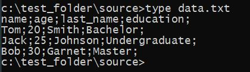
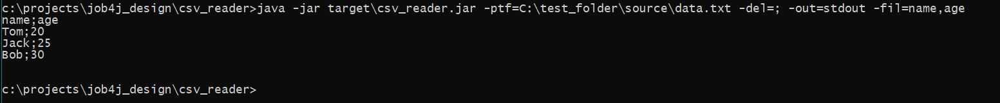
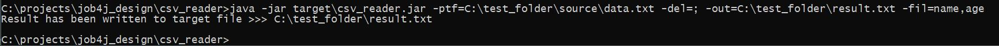
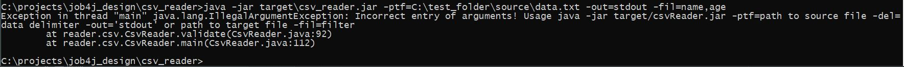
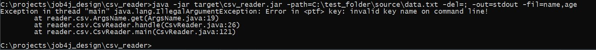
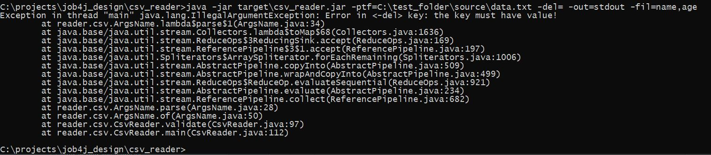
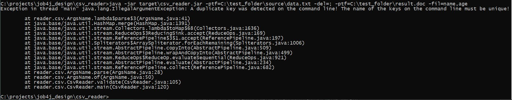

# Job4j_Util_CSVReader
### Это утилита для парсинга файлов текстового формата csv с применением фильтрации


___
### Техническое задание.

1. При запуске указывается путь к файлу для парсинга, например c:\project\job4j\data.csv <br><br>

2. В качестве ключей передаётся:
    - разделитель;
    - фильтр по столбцам;
    - приёмник данных. Ключ имеет только два допустимых значения: stdout (вывод в консоль) или путь к файлу, куда нужно вывести результат. <br><br>
   
3. Запуск проекта:

>  -ptf=file.csv&nbsp;&nbsp;-del=;&nbsp;&nbsp;-out=stdout&nbsp;&nbsp;-fil=name,age

- -ptf {path to file} : путь к исходному файлу;
- -del {delimiter} : обозначение разделителя данных;
- -out {output}: приёмник выходных данных;
- -fil {filter} : список столбцов для отображения в выходных данных.

<br>

___
### Требования к окружению

- Java 11
- Maven v.3.6.3

<br>

---
### Запуск утилиты

1. Скачать файлы проекта с github по ссылке и разархивировать в выбранную директорию:<br>
   [https://github.com/MasterMaxTs/job4j_design_utils/archive](https://github.com/MasterMaxTs/job4j_design_utils/archive/refs/heads/master.zip)


2. Перейти в директорию проекта, в папке <b>csv_reader</b> открыть командную строку <b> от имени администратора</b>.</br>
    - Для <ins>первого</ins> запуска утилиты выполнить последовательно команды:
        - ```mvn package -Dmaven.test.skip=true```
        - ```java -jar target/csv_reader.jar -ptf=<PATH_TO_FILE> -del=<DATA_DELIMITER> -out=<OUTPUT_RESULT> -fil=<DATA_FILTER>```

    - Для <ins>последующего</ins> запуска приложения выполнять команду:
        - ```java -jar target/csv_reader.jar -ptf=<PATH_TO_FILE> -del=<DATA_DELIMITER> -out=<OUTPUT_RESULT> -fil=<DATA_FILTER>```

<br>

___
### Взаимодействие с утилитой
<br>

1. Вид из консоли: структура входного файла:<br><br>
   


2. Вид из консоли: успешный парсинг файла (вывод в консоль):<br><br>
   


3. Вид из консоли: успешный парсинг файла (вывод в файл):<br><br>
   


4. Вид из консоли: исключительные ситуации, связанные с ошибочным пользовательским вводом данных:
- не полностью введены аргументы командной строки:
  <br><br>
    - 


- введенo неверное имя ключа:
  <br><br>
    - 


- введенo неверное значение ключа путь к входному файлу:
  <br><br>
    - -value.JPG)


- введенo неверное значение ключа разделитель данных:
  <br><br>
    - -value.JPG)


- введенo неверное значение ключа фильтр выходных данных:
  <br><br>
    - -value.JPG)


- введенo неверное значение ключа приёмник выходных данных:
  <br><br>
    - -value.JPG)


- введенo неверное значение ключа приёмник выходных данных:
  <br><br>
    - -value-2.JPG)


- не введено значение ключа:
  <br><br>
    - 


- введены ключи с одинаковым названием:
  <br><br>
    - 


___
### Контакты
* Email: java.dev-maxim.tsurkanov@yandex.ru
* Skype: https://join.skype.com/invite/ODADx0IJ3BBu
* VK: https://m.vk.com/id349328153
* Telegram: matsurkanov