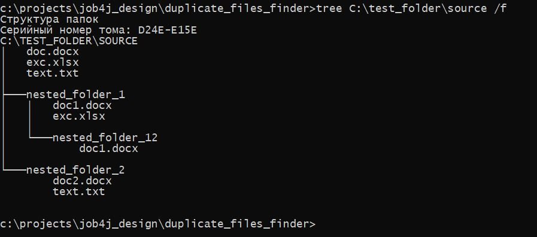
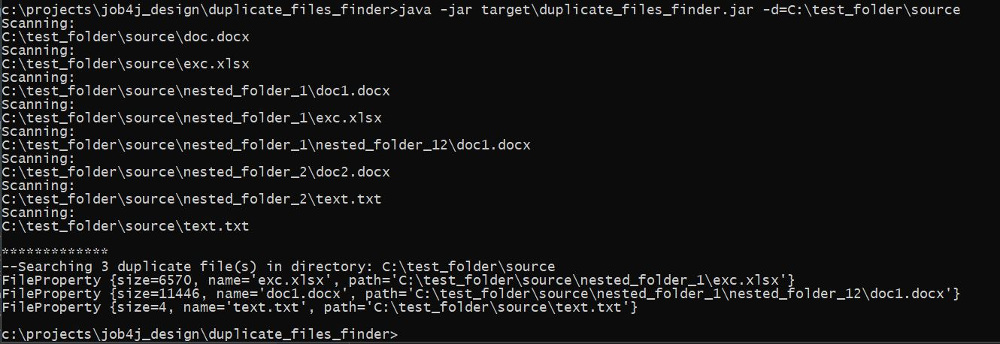
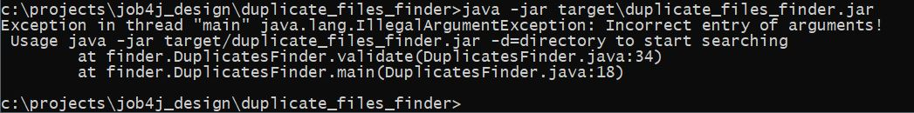
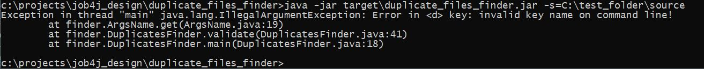
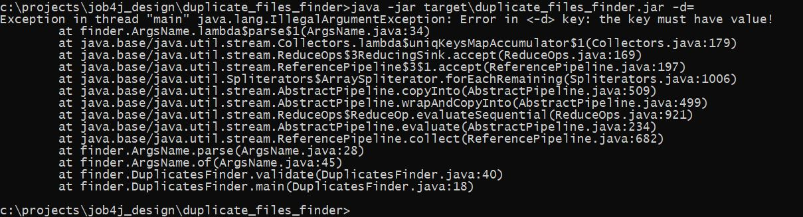

# Job4j_Util_Duplicate_files_finder
### Это утилита для поиска файлов-дубликатов в папке


___
### Техническое задание.

1. При запуске указывается папка, в которой будет выполнен поиск файлов-дубликатов, например c:\project\job4j\ <br><br>
2. Запуск проекта:
> -d=c:\project\job4j
- -d {directory} : путь к папке, в которой будет выполняться поиск файлов-дубликатов.<br><br>
3. Результат поиска в виде списка файлов выводится в консоль.<br><br>
4. Файл имеет характеристики: 
   - размер;
   - имя;
   - абсолютный путь к расположению.
<br>

___
### Требования к окружению

- Java 11
- Maven v.3.6.3

<br>

---
### Запуск утилиты

1. Скачать файлы проекта с github по ссылке и разархивировать в выбранную директорию:<br>
   [https://github.com/MasterMaxTs/job4j_design_utils/archive](https://github.com/MasterMaxTs/job4j_design_utils/archive/refs/heads/master.zip)


2. Перейти в директорию проекта, в папке <b>duplicate_files_finder</b> открыть командную строку.</br>
    - Для <ins>первого</ins> запуска утилиты выполнить последовательно команды:
        - ```mvn package -Dmaven.test.skip=true```
        - ```java -jar target/duplicate_files_finder.jar -d=<SOURCE_FOLDER>```

    - Для <ins>последующего</ins> запуска приложения выполнять команду:
        - ```java -jar target/duplicate_files_finder.jar -d=<SOURCE_FOLDER>```

<br>

___
### Взаимодействие с утилитой
<br>

1. Вид из консоли: структура файлов в папке поиска:<br><br>
   


2. Вид из консоли: поиск файлов-дубликатов:<br><br>
   


3. Вид из консоли: исключительные ситуации, связанные с ошибочным пользовательским вводом данных:
- не введены аргументы командной строки:
  <br><br>
    - 


- введенo неверное значение ключа исходная директория:
  <br><br>
    - -value.JPG)


- введенo неверное имя ключа:
  <br><br>
    - 


- не введено значение ключа:
  <br><br>
    - 

    
___
### Контакты
* Email: java.dev-maxim.tsurkanov@yandex.ru
* Skype: https://join.skype.com/invite/ODADx0IJ3BBu
* VK: https://m.vk.com/id349328153
* Telegram: matsurkanov