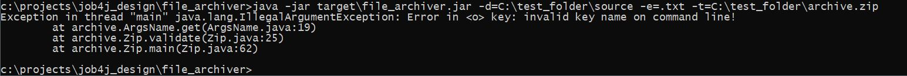

# Job4j_Util_File_archiver
### Это небольшая утилита для архивации папки c сохранением вложенной структуры 


___
### Техническое задание.

1. При запуске указывается папка, которую мы хотим архивировать, например: c:\project\job4j\ <br><br>
2. В качестве ключей передаётся:
    - расширение файлов, которые не нужно включать в архив;
    - путь к выходному zip файлу. <br><br>
3. Архив должен сохранять структуру проекта. То есть содержать подпапки. <br><br>
4. Запуск проекта:

  > -d=c:\project\job4j\&nbsp;&nbsp;-e=.class&nbsp;&nbsp;-o=c:\project\job4j.zip


 - -d {directory} - путь к архивируемой папке с файлами;
 - -e {exclude} - исключить из архивирования файлы с расширением class;
 - -o {output} - путь к выходному zip файлу.

<br>

___
### Требования к окружению

- Java 9
- Maven v.3.6.3

<br>

---
### Запуск утилиты

1. Скачать файлы проекта с github по ссылке и разархивировать в выбранную директорию:<br>
   [https://github.com/MasterMaxTs/job4j_design_utils/archive](https://github.com/MasterMaxTs/job4j_design_utils/archive/refs/heads/master.zip)


2. Перейти в директорию проекта, в папке <b>file_archiver</b> открыть командную строку <b>от имени администратора</b>.</br>
   - Для <ins>первого</ins> запуска утилиты выполнить последовательно команды:
       - ```mvn package -Dmaven.test.skip=true```
       - ```java -jar target/file_archiver.jar -d=<SOURCE_FOLDER> -e=<EXCLUDE_FILE_EXTENSION> -o=<TARGET_ZIP_FILE>```

   - Для <ins>последующего</ins> запуска приложения выполнять команду:
      - ```java -jar target/file_archiver.jar -d=<SOURCE_FOLDER> -e=<EXCLUDE_FILE_EXTENSION> -o=<TARGET_ZIP_FILE>```

<br>

___
### Взаимодействие с утилитой
<br>

1. Вид из консоли: структура файлов в архивируемой папке:<br><br>
   


2. Вид из консоли: успешная архивация папки:<br><br>
   

   
3. Вид из консоли: исключительные ситуации, связанные с ошибочным пользовательским вводом данных:<br>
- не введены аргументы командной строки:
  <br><br>
    - 


- введенo неверное значение ключа:
  <br><br>
    - -value.JPG)


- введенo неверное расширение выходного архивного файла:
  <br><br>
    - 


- не введено значение ключа:
  <br><br>
    - 


- введенo неверное название ключа:
  <br><br>
    - 


- введены ключи с одинаковым названием:
  <br><br>
    - 

___
### Контакты
* Email: java.dev-maxim.tsurkanov@yandex.ru
* Skype: https://join.skype.com/invite/ODADx0IJ3BBu
* VK: https://m.vk.com/id349328153
* Telegram: matsurkanov