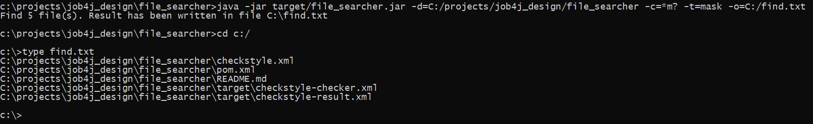
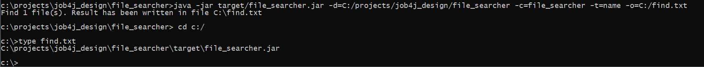
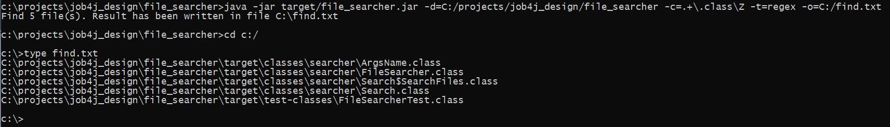
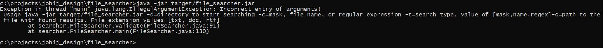
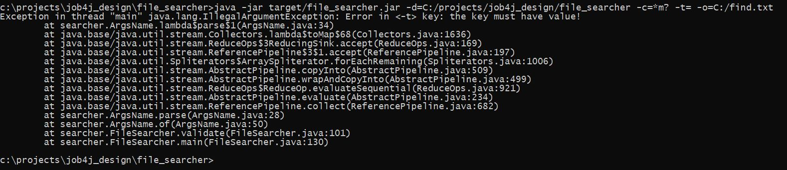
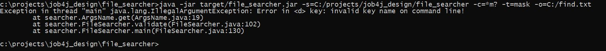
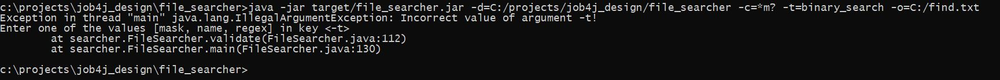
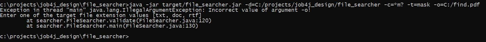
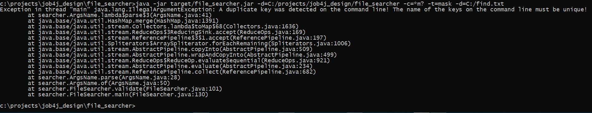

# Job4j_Util_File_searcher
### Это небольшая утилита для поиска файлов


___
### Техническое задание.

1. При запуске указывается папка, в которой будет выполнен поиск файлов, например c:\project\job4j\ <br><br>
2. В качестве ключей передаётся:
   - условие поиска;
   - тип поиска:
     - mask: поиск по маске файла;
     - name: поиск по имени файла;
     - regex: поиск по регулярному выражению;
   - путь к выходному файлу, содержащему результаты поиска. <br><br>
3. Запуск проекта:

 > -d=c:\project\job4j\&nbsp;&nbsp;-c=.+\.class\Z&nbsp;&nbsp;-t=regex&nbsp;&nbsp;-o=c:\project\find.txt

 - -d {directory} : путь к корневой папке, в которой будет выполняться поиск файлов;
 - -c {condition} : условие поиска, согласно типу;
 - -t {search type} : тип поиска файлов: [mask, name, regex];
 - -o {output} : путь к выходному файлу с результатом поиска. Файл может иметь одно из расширений: [txt, doc, rtf].

<br>

___
### Требования к окружению

- Java 11
- Maven v.3.6.3

<br>

---
### Запуск утилиты

1. Скачать файлы проекта с github по ссылке и разархивировать в выбранную директорию:<br>
   [https://github.com/MasterMaxTs/job4j_design_utils/archive](https://github.com/MasterMaxTs/job4j_design_utils/archive/refs/heads/master.zip)


2. Перейти в директорию проекта, в папке <b>file_searcher</b> открыть командную строку <b>от имени администратора</b>.</br>
    - Для <ins>первого</ins> запуска утилиты выполнить последовательно команды:
        - ```mvn package -Dmaven.test.skip=true```
        - ```java -jar target/file_searcher.jar -d=<ROOT_FOLDER> -c=<CONDITION> -t=<SEARCH_TYPE> -o=<TARGET_RESULT_FILE_>```

    - Для <ins>последующего</ins> запуска приложения выполнять команду:
        - ```java -jar target/file_searcher.jar -d=<ROOT_FOLDER> -c=<CONDITION> -t=<SEARCH_TYPE> -o=<TARGET_RESULT_FILE_>```

<br>

___
### Взаимодействие с утилитой
<br>

1. Вид из консоли: поиск файлов по маске:<br><br>
   


2. Вид из консоли: поиск файлов по имени:<br><br>
   


3. Вид из консоли: поиск файлов по регулярному выражению:<br><br>
   


4. Вид из консоли: исключительные ситуации, связанные с ошибочным пользовательским вводом данных:<br><br>
 - не введены аргументы командной строки:
<br><br>
   - 


- не введено значение ключа:
<br><br>
    - 


- введенo неверное название ключа:
<br><br>
    - 


- введенo неверное значение ключа исходной директории:
<br><br>
    - -value.JPG)


- введенo неверное значение ключа типа поиска:
  <br><br>
    - 


- введенo неверное значение ключа пути к результирующему файлу (неподдерживаемое расширение файла):
  <br><br>
    - 
  

- введены ключи с одинаковым названием:
  <br><br>
    - 

___
### Контакты
* Email: java.dev-maxim.tsurkanov@yandex.ru
* Skype: https://join.skype.com/invite/ODADx0IJ3BBu
* VK: https://m.vk.com/id349328153
* Telegram: matsurkanov